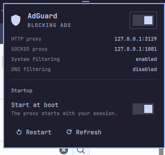

# AdGuard — Omarchy plugin



[AdGuard CLI](https://adguard.com/kb/adguard-for-linux/) status in the
Omarchy bar. A shield icon shows whether the ad-blocking proxy is running;
click it for a panel that starts or stops the service, shows the proxy
addresses and filtering state, and decides whether the proxy comes back on
the next boot.

- **Icon** — bright shield while blocking, dimmed when stopped, an alert
  shield if the service failed.
- **Left click** opens the panel. **Right click** toggles the service.
  **Middle click** refreshes.
- **Run switch** starts or stops the systemd user unit.
- **Start at boot** enables or disables the unit. Turning it off leaves the
  proxy running for this session; it simply does not start next time.
- **Restart** and **Refresh** buttons, and arrow-key navigation with Enter.

## Requirements

- Omarchy 4 (the Quickshell-based `omarchy-shell`)
- [AdGuard CLI](https://adguard.com/kb/adguard-for-linux/installation/)
  installed and configured (`adguard-cli configure`)
- A systemd **user** unit that runs `adguard-cli start --no-fork`. One is in
  [`contrib/adguard-cli.service`](contrib/adguard-cli.service):

  ```bash
  mkdir -p ~/.config/systemd/user
  cp contrib/adguard-cli.service ~/.config/systemd/user/
  systemctl --user daemon-reload
  systemctl --user enable --now adguard-cli.service
  ```

  The unit passes `--pid-file` so `adguard-cli status` and `adguard-cli stop`
  still recognise the service-managed proxy. AdGuard keeps its state under
  `~/.local/share/adguard-cli`, so nothing needs root.

Nothing else: `jq`, `systemctl` and the coreutils the helper uses are already
on a stock Omarchy install. The helper looks for `adguard-cli` at
`/usr/local/bin/adguard-cli` (where AdGuard's installer puts it) or
`/usr/bin/adguard-cli`; it does not search `PATH`.

## Install

```bash
omarchy plugin add https://github.com/ram-arrowebs/omarchy-adguard.git
```

Accept the prompt to enable it, or enable it yourself and put it next to the
network icon:

```bash
omarchy plugin enable ram.adguard --section right --before omarchy.network
```

## Update

```bash
omarchy plugin update ram.adguard
```

## Removing

```bash
omarchy plugin remove ram.adguard
```

That removes the widget and everything it installed, which is only its own
directory. The plugin writes no files, so nothing of its own survives. The
systemd unit at `~/.config/systemd/user/adguard-cli.service` is yours, created
by you in the step above, and stays as it is; run
`systemctl --user disable --now adguard-cli.service` and delete the file if
you no longer want the proxy either. AdGuard CLI itself is untouched.

## Settings

Per-widget settings live on its entry in `~/.config/omarchy/shell.json`:

| Key | Default | Meaning |
|---|---|---|
| `unit` | `adguard-cli.service` | Name of the systemd user unit to control |
| `refreshIntervalSec` | `10` | How often the state is re-read (3–600) |

```json
{ "id": "ram.adguard", "unit": "adguard-cli.service", "refreshIntervalSec": 10 }
```

## Keybinds and scripts

The plugin answers on the `ram.adguard` IPC target:

```
omarchy-shell ram.adguard toggle         # open or close the panel
omarchy-shell ram.adguard toggleService  # start or stop the proxy
omarchy-shell ram.adguard start
omarchy-shell ram.adguard stop
omarchy-shell ram.adguard enableBoot
omarchy-shell ram.adguard disableBoot    # keep running now, skip next boot
omarchy-shell ram.adguard refresh
omarchy-shell ram.adguard status         # "Blocking ads", "Proxy stopped", ...
```

For example, in `~/.config/hypr/bindings.lua`:

```
bind = SUPER SHIFT, G, exec, omarchy-shell ram.adguard toggleService
```

## What it does on your system

- **Commands it runs**, all by fixed path under `/usr/bin` and as argv arrays:
  `systemctl --user is-active | is-enabled | start | stop | restart | enable |
  disable -- <unit>`, and `adguard-cli status` (read-only). Inside
  `bin/adguard-state` the output of each is capped at 8 KiB, given a 10 s
  deadline through `timeout`, filtered by `sed`, `grep` and `awk`, and turned
  into one JSON line with `jq`. The shell side caps the helper's output again
  and stops it with TERM then KILL if it outlives 30 s.
- **Inputs it trusts**: the `unit` setting is accepted only when it is a plain
  unit name ending in `.service`; otherwise the default is used. Every value
  read back from systemd or AdGuard is matched against a short allowlist or an
  address pattern before it is shown, and every text in the panel renders as
  plain text.
- **Privileges**: none beyond your own user. No sudo or pkexec is required;
  `systemctl` is only ever called with `--user`.
- **Files**: none. It writes nothing, not even inside its own directory.
- **Network**: none of its own. AdGuard's proxy is AdGuard's business.
- **Background**: nothing. The state is polled from a timer in the shell, one
  short-lived helper at a time.

## Security

This plugin runs unsandboxed inside `omarchy-shell` when enabled. Review its
source and the behaviour above before installing it.

## Validate from source

```bash
omarchy plugin validate .
```

## License

[MIT](LICENSE)
